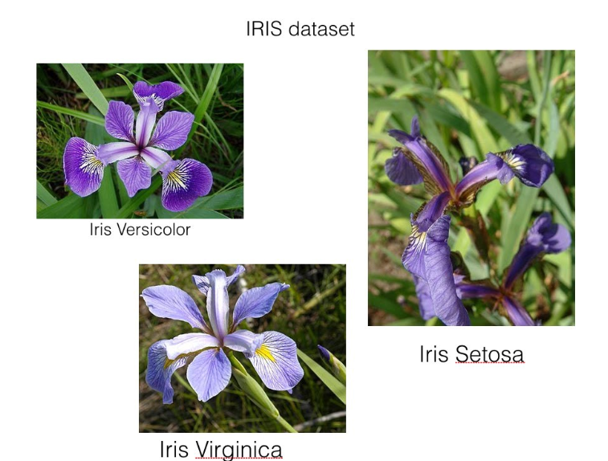

# Ross Hunter, 2019, Iris Data Set Project

This repository contains my project in regards to review of Fisher's Iris Data Set as part of programming and scripting module for Higher Diploma in Data Analytics, GMIT.
[See here for instructions](https://github.com/ianmcloughlin/project-pands/raw/master/project.pdf)

# Introduction

The Iris flower data set or Fisher's Iris data set is a multivariate data set introduced by the British statistician and biologist Ronald Fisher in his 1936 paper The use of multiple measurements in taxonomic problems as an example of linear discriminant analysis. It is sometimes called Anderson's Iris data set because Edgar Anderson collected the data to quantify the morphologic variation of Iris flowers of three related species. Two of the three species were collected in the Gaspé Peninsula "all from the same pasture, and picked on the same day and measured at the same time by the same person with the same apparatus".

The data set consists of 50 samples from each of three species of Iris (Iris setosa, Iris virginica and Iris versicolor). Four features were measured from each sample: the length and the width of the sepals and petals, in centimeters. Based on the combination of these four features, Fisher developed a linear discriminant model to distinguish the species from each other.

# What is the data set used for

The Iris flower data set is a classic, well-known data set example for data mining and data exploration. The data set contains 150 records of three different types (classes) of iris flowers with numeric values for petal length and width and sepal length and width.

This data set is traditionally used for classification and prediction – to see which features of an iris can identify the flower as a certain type of iris. The values for length and width can be used to classify an iris into one of three iris types: Iris setosa, Iris versicolor, or Iris virginica. Visually exploring this data also lets you see the grouping (clustering) of the records into these three different types of irises.

# Who is Ronald Fisher

Although Ronald Fisher’s name is less well-known than some others, he was one of the twentieth century’s greatest scientists.

In addition to being probably the greatest statistician ever, he also invented experimental design and was one of the principal founders of population genetics. He unified the disconnected concepts of natural selection and Mendel’s rules of inheritance. The importance of his book Statistical Methods for Research Workers in quantitative biology has been likened to that of Isaac Newton’s Principia in physics.

# Where to find code/examples

# Review of Code

# Discussion of simple machine learning example

# References/Links