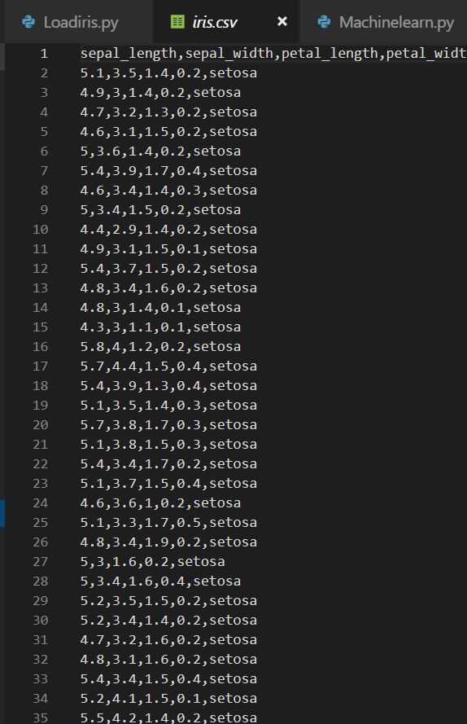

# Ross Hunter, 2019, Iris Data Set Project

This repository contains my project in regards to review of Fisher's Iris Data Set as part of programming and scripting module for Higher Diploma in Data Analytics, GMIT.
[See here for instructions](https://github.com/ianmcloughlin/project-pands/raw/master/project.pdf)

# Introduction

The Iris data set is a multivariate data set introduced by the British statistician and biologist Ronald Fisher in his 1936 paper The use of multiple measurements in taxonomic problems as an example of linear discriminant analysis. It is sometimes called Anderson's Iris data set because Edgar Anderson collected the data to quantify the morphologic variation of Iris flowers of three related species. Two of the three species were collected in the Gaspé Peninsula "all from the same pasture, and picked on the same day and measured at the same time by the same person with the same apparatus".

# What is the data set used for

The Iris flower data set is a classic, well-known data set example for data mining and data exploration. The data set contains 150 records of three different types (classes) of iris flowers with numeric values for petal length and width and sepal length and width.

This data set is traditionally used for classification and prediction. The values for length and width can be used to classify an iris into one of three iris types: Iris setosa, Iris versicolor, or Iris virginica. Visually exploring this data also lets you see the grouping (clustering) of the records into these three different types of irises.

# Who is Ronald Fisher

Although Ronald Fisher’s name is less well-known than some others, he was one of the twentieth century’s greatest scientists.

In addition to being probably the greatest statistician ever, he also invented experimental design and was one of the principal founders of population genetics.The importance of his book Statistical Methods for Research Workers in quantitative biology has been likened to that of Isaac Newton’s Principia in physics.

# Review of Code

1. So the first step taken was to import all your packages to be able to perform your data analysis on the iris data set. Packages were imported using numpy, pandas, Mathploltlib, warnings, seaborn and sklearn. 

2. The first analysis step performed was to import the raw daw. I downloaded file to my pc and file could be read using pandas.read_csv.

3. The number of rows and columns was then obtained from raw data set. Result was 150 rows and 5 columns of sepal lenght and width, petal lenght and width and species.

4. The next analysis is to show how you can get just a quick snapshot of the data. Result shows the first 20 rows of data.

5. Then a breakdown of each attribute is performed across the 150 rows of data resulting in outputs of count, mean, standard deviation, min, max and some percentiles.

6.  Datasets were created for each species which contained 50 of setosa, versicolor and virginicia resulting in outputs of count, mean, standard deviation, min, max and some percentiles.

7. Performed a simple analysis on the the # of rows for each species.

8. 

# Discussion of simple machine learning example 

# References/Links
[Machine Learning Project in Python](https://machinelearningmastery.com/machine-learning-in-python-step-by-step/)
[Scikit Learn](https://scikit-learn.org/stable/auto_examples/datasets/plot_iris_dataset.html)
[Python - Iris Data Visulization and Explanation](https://www.kaggle.com/abhishekkrg/python-iris-data-visualization-and-explanation)
[A simple machine learning project](https://dev.to/liveedutv/a-simple-machine-learning-project-in-python-5d11)
[Ronald Fisher](https://en.wikipedia.org/wiki/Ronald_Fisher)
[Famous Scientists](https://www.famousscientists.org/ronald-fisher/)
[Anaconda](https://www.anaconda.com/)
[cmder](http://cmder.net/)
[Visual Studio Code](https://code.visualstudio.com/)

# Some useful links to videos
[Getting started in Scikit Learn with Iris Data Set](https://www.youtube.com/watch?v=hd1W4CyPX58)